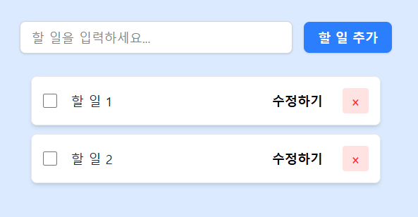
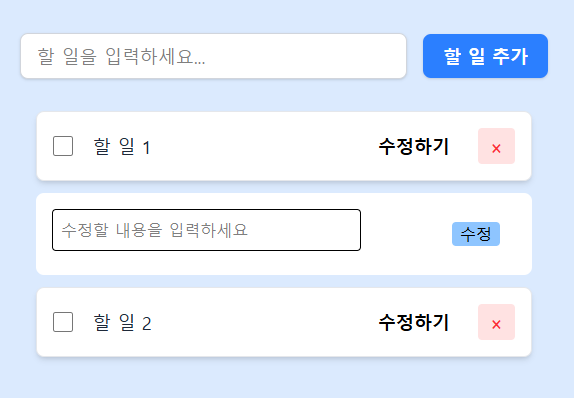
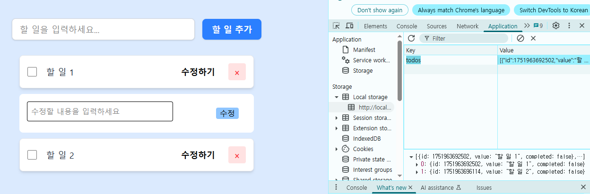

# 📝 React Todo Mission1

React + JavaScript 기반의 Todo 애플리케이션입니다.  
Context API로 전역 상태를 관리하고, Tailwind css로 스타일링합니다. <br />
localStorage를 통해 데이터를 영구히 저장합니다.<br />
컴포넌트 모듈화 / 커스텀 Hook 사용<br />

---

## 🚀 실행 방법

```bash
npm install
npm run dev
```

---

## 📂 프로젝트 구조

```bash
src/
├── components/           # Todo 관련 UI 컴포넌트
│   ├── TodoItem.jsx
│   ├── TodoList.jsx
│   └── TodoWriteForm.jsx
├── context/              # Context API
│   └── TodosContext.jsx
├── hooks/                # 커스텀 훅
│   └── useTodos.js
├── utils/                # 유틸 함수
│   └── storage.js
├── App.jsx               # 루트 컴포넌트
├── index.css             # 전역 스타일
└── main.jsx              # 진입 파일

```

---

## ✅ 주요 기능

- [x] Todo 추가/삭제/완료 체크
- [x] 기존 Todo 내용 수정 기능
- [x] Context API를 이용한 State 전역 관리 기능
- [x] 커스텀 훅 (`useTodos`) 사용
- [x] localStorage를 이용해 앱 최초 로딩 시 todos 불러오기
- [x] Tailwind CSS를 활용한 스타일링
- [x] 기능별 폴더 구조화

---

## ✅ 기능 구현

- Todo

## 📸 스크린샷

- 

- 

- 

## 🔗 관련 이슈

- (있다면 작성)

```

---

## 📦 사용 기술 스택

- React
- JavaScript
- Context API
- Tailwind CSS
- ESLint / Prettier

---

## 🙌 기여 방법

1. 이슈 생성 및 브랜치 분기
2. 기능 구현 및 커밋
3. 템플릿에 따라 PR 작성 및 등록
```
